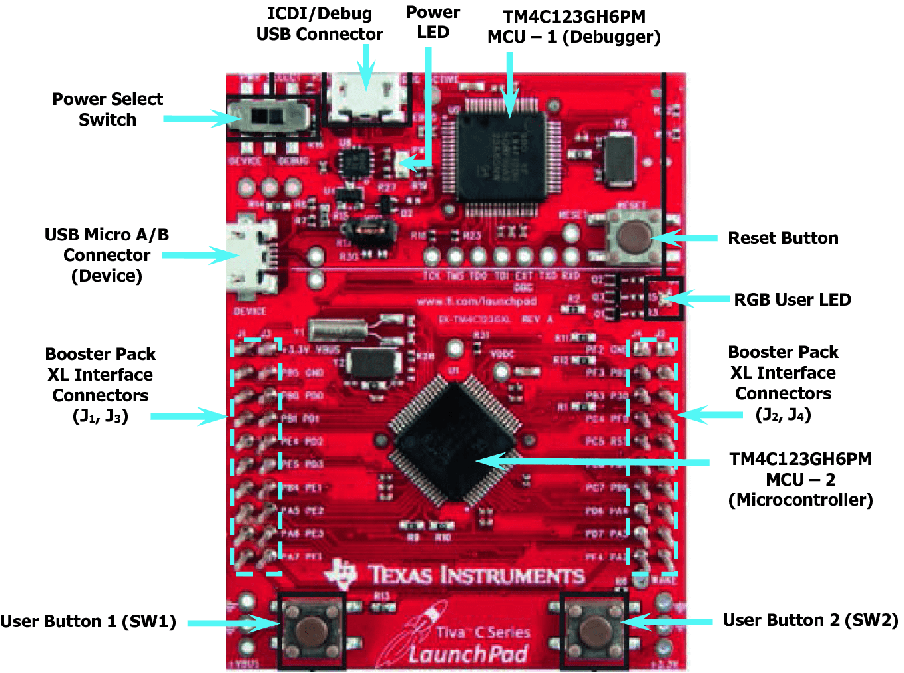

#                   XO Game
We will introduce XO game using microcontroller (**tm4c123gh6pm**) **Tiva-C LaunchPad** 

## Hardware I/O connections

the project can run on simulator directly `keil for example`

for using hardware, these components can be used: 

- Tiva C launchPad
- Nokia5110 Screen (Blue)
- Breadboard
- Resistors
- 3 Leds
- Jumbers (connectors)
- 2 switches

### Blue Nokia 5110 Connections
