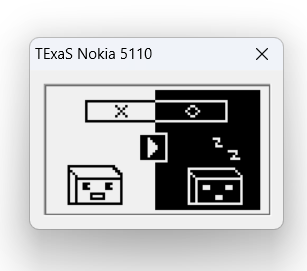
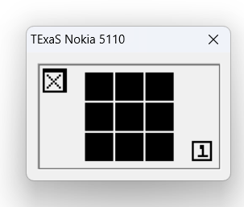
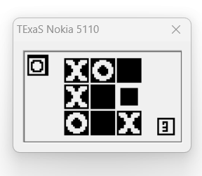
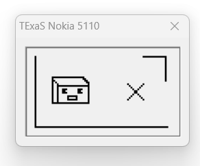
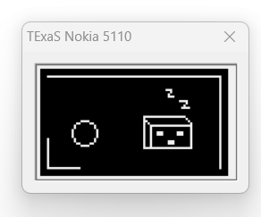
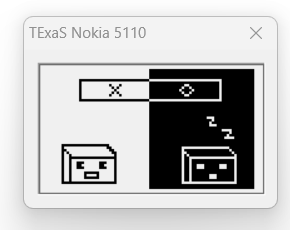
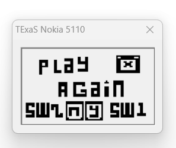
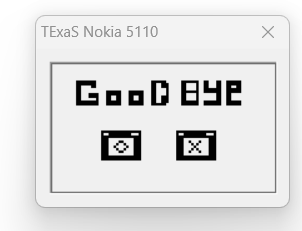

#                   XO Game
We will introduce XO game using microcontroller (**tm4c123gh6pm**) **Tiva-C LaunchPad** 

## Hardware I/O connections

the project can run on simulator directly `keil for example`

for using hardware, these components can be used: 

- Tiva C launchPad
- Nokia5110 Screen (Blue)
- Breadboard
- Resistors
- 3 Leds
- Jumbers (connectors)
- 2 switches

#### Blue Nokia 5110 Connections

|           Signal          |           (Nokia 5110) LaunchPad pin          |
| ------------------------- | --------------------------------------------- |
|           Reset           |           (RST, pin 1) connected to PB7       |
|           SSI0Fss         |           (CE,  pin 2) connected to PB3       |
|           Data/Command    |           (DC,  pin 3) connected to PB6       |
|           SSI0Tx          |           (Din, pin 4) connected to PB5       |
|           SSI0Clk         |           (Clk, pin 5) connected to PB2       |
|           3.3V            |           (Vcc, pin 6) power                  |
|           back light      |           (BL,  pin 7) not connected          |
|           Ground          |           (Gnd, pin 8) ground                 |

#### Other connections

| component        | (Nokia 5110) LaunchPad pin  |
| ---------------- | --------------------------- |
| move switch      |   PB0                       |
| update switch    |   PB1                       |
| first player led |   PB2                       |
| second player led|   PB3                       |
| update led       |   PB7                       |

## Game veiws

start game 

        

X take turn  

 O take turn   

  X wins   

 O wins   

 Draw   

 Play agian?    

 End Game   

## Team Members
- Mahmoud Essam 
- Mahmoud Mohamed
- Khaled Ramadan
- Samar Mahmoud 
- Esraa Said 